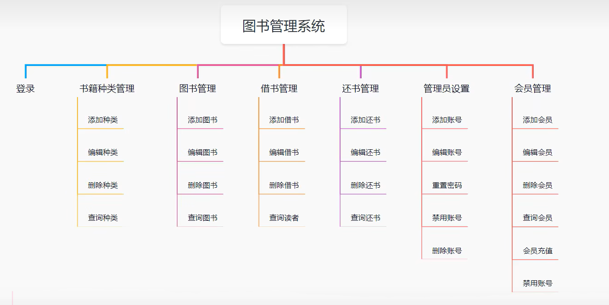
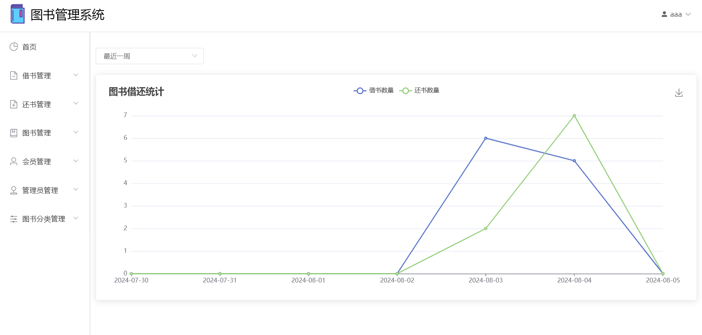
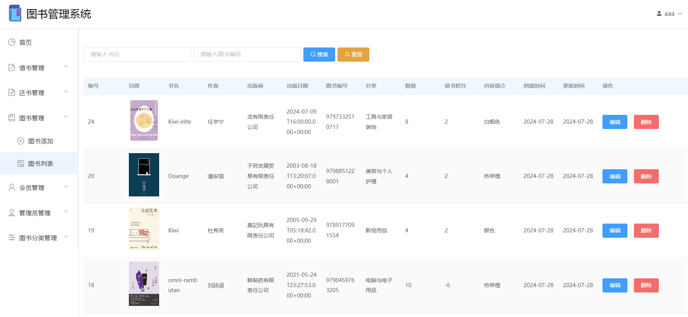
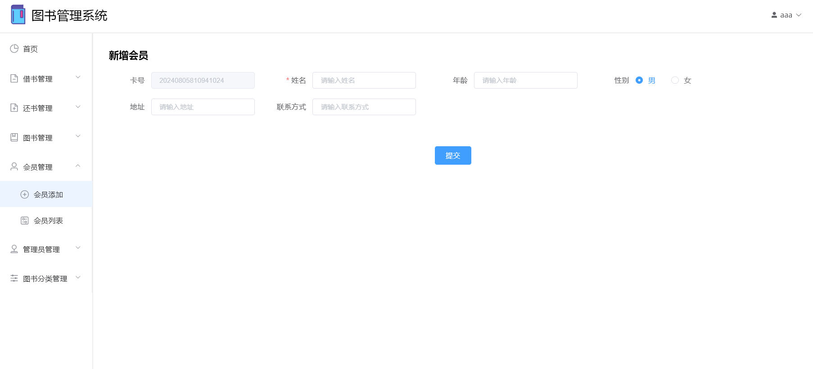
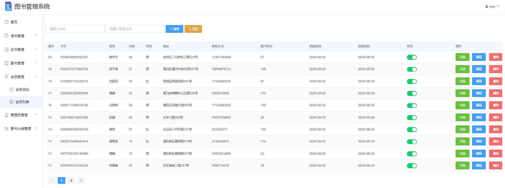

# LibraryManagement
### 图书管理系统 (Vue2 + SpringBoot + MyBatis + MySQL)
 
### 主要功能：

### 部分功能页面展示：
* #### 登录界面

* #### 登录界面滑块验证

* #### 首页借还统计

* #### 借书添加

* #### 借书列表

* #### 还书列表

* #### 图书添加

* #### 图书列表

* #### 图书编辑

* #### 会员添加

* #### 会员列表

* #### 管理员列表

* #### 图书分类列表

